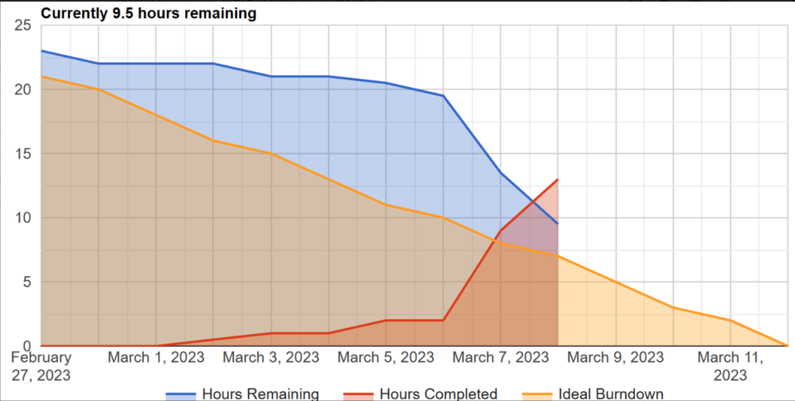
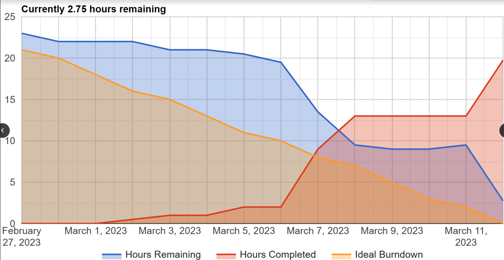

# georgia-sweets-group-10

# Trello Board

https://trello.com/invite/b/YdgIjphD/ATTI4749f0685ba7cc025dd70f56579f6b9578CF7B44/georgia-sweets-group-10

# Repo URL
https://github.com/connor-kolb-13/georgia-sweets-group-10

# User Stories

1. As a customer, I want to have a clean, professional looking, gallery page where I can view past products to inspire a custom box, or help me decide on a holiday box to order.

2. As a customer, I want to be able to track my current orders, to see where in the process the order is, and its expected completition (either pick up or delivery) date.

3. As an admin, I want to be able to add holiday packs to the shop, with the ability to insert images and a description of the box (as well as the price).

4. As an admin, I want to be able to update the gallary page with images of the newest orders on the dashboard.

5. As an admin, I want to be able to see order requests, pending orders, and completed orders on the dashbaord.

# User Stories Task Chart

# Burndown Charts

# Daily Stand Ups

Questions:

1. What did you do yesterday?
2. What are you planning to do today?
3. Any problems are you facing?

## March 1st Stand Up

Connor:

1. Yesterday I finalized the Trello board.
2. Today I plan to finish the burndown chart time estimates
3. No problems at this time!

Alex:

1.
2.
3.

Isaac:

1. Yesterday I created and initialized Google Firebase in the project and added group members as collaborators.
2. Today I set-up hosting, authentication, and firestore database.
3. No issues at this time.

Trent:

1.
2.
3.

Mason:

1. Yesterday I worked with the prototype through Justinmind with Trent, making minor edits and changes.
2. Today I organized the tasks into the task chart so the trello board can be finalized.
   3)I am not having any obstacles at the moment!

## March 6th Stand Up

Connor:

1. Yesterday I got started on our HTML file (set up basic structure and set precedence for naming conventions)
2. Today I plan to work more on the homepage.
3. Only problem I have right now is deciding what content to include (i.e. the text on the homepage)

Alex:

1.
2.
3.

Isaac:

1. Yesterday I started looking into how we can possibly implement online payments with the site.
2. Today I looked into it more and it's fairly simple, will need advisory from the client.
3. I Had trouble fetching and seeing the updates to the document, but a restart and update of my computer resolved the issue.

Trent:

1.
2.
3.

Mason:

1. Yesterday I talked with my sister (the client) to gather some photos she may want to use for the gallery page.
2. Today I plan to pull work done by Conner to run it past my sister and get initial feedback.
3. I am running into some troubles when fetching remote branches Connor worked on, but I am hoping to figure that out today.

## March 9th Stand Up

Connor:

1. Yesterday I finished up the outline of the homepage.
2. Today I plan to review the sprint requirements and make sure we have everything for submission.
3. No questions at this time.

Alex:

1.
2.
3.

Isaac:

1. Yesterday I reviewed the work currently done on the website and analyzed what needed to be done for the rest of the sprint.
2. Today I worked on adding the code needed for firebase deployment to the website.
3. No further issues regarding the fetching or otherwise.

Trent:

1.
2.
3.

Mason:

1. Yesterday I reviewed milestone 1 to ensure I am aware of project capabilities and goals.
2. Today, I plant to start working on the html for the "About Us" page and designing the framework around it!
3. I am wondering what the difference between the home page and about us page will be. I will talk with my group members to lay this out.

# Sprint Review

a. What did you learn from doing our first sprint?

 Our team learned the importance of quality planning and communication. The process of breaking down tasks from user stories and input from multiple user types allowed us to break down the activities that needed to be done into manageable chunks. As a group, we were better able to see the big picture when things were broken down and we were able to grab different tasks. Each group memeber took the tasks from the trello board that be aligned with their interests/skills, and completed those. Additionally, it's hard to complete a project like this will little communication; talking with each other at meetings and through texting allowed up to realize a team that is not close or open to talking will not get very far using scrum and other agile methodologies. 

b. What did go well? Why?

 Translating our user stories into different tasks went really well. This allowed for a seamless transition from what the end product should look like to what needed to be done to get there. As a team, we had a better picture of what steps we need to be take to accomplish everything our client wants. This process also allowed for an easy way for the group to agree on the steps to be done; we could all see how these steps were derived from user stories, so there was no large disagreements or arguments. 

c. What didn’t go well? Why not?

d. How can you make things better next time?

e. Are you satisfied with what you already completed?

f. Which group was invited? What are your observations/notes? Everybody was present?
